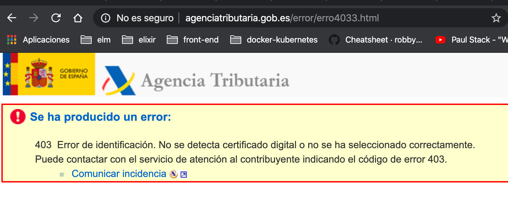
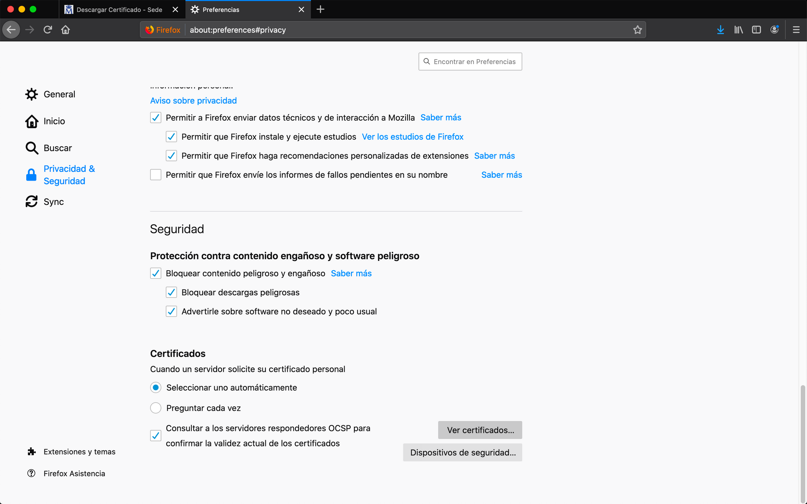
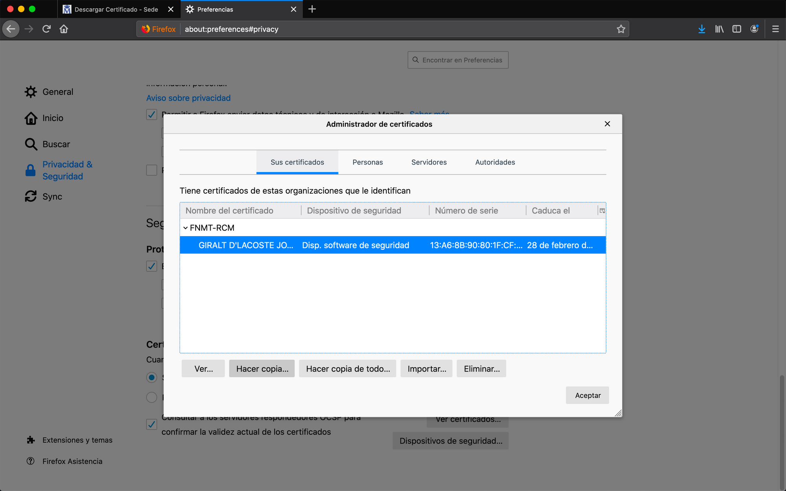
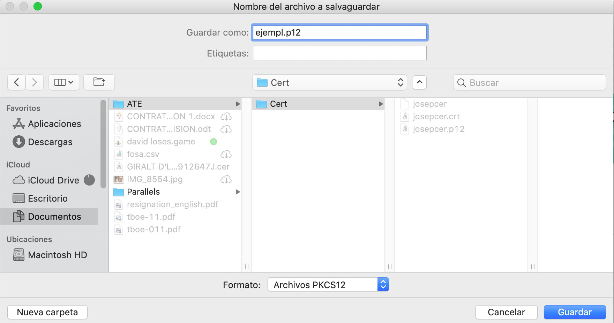
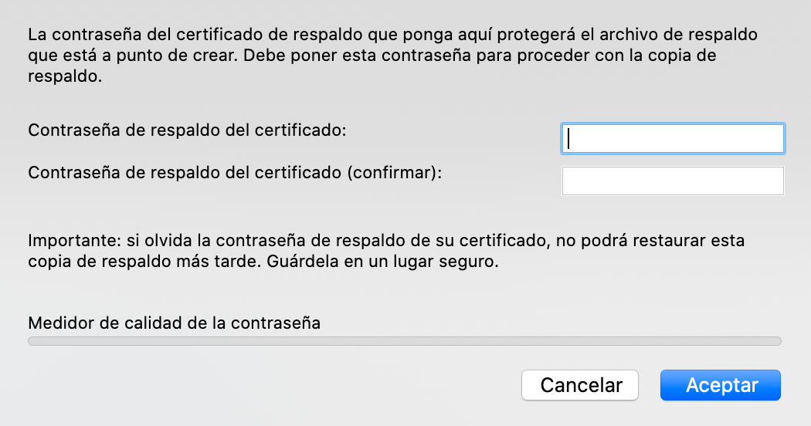
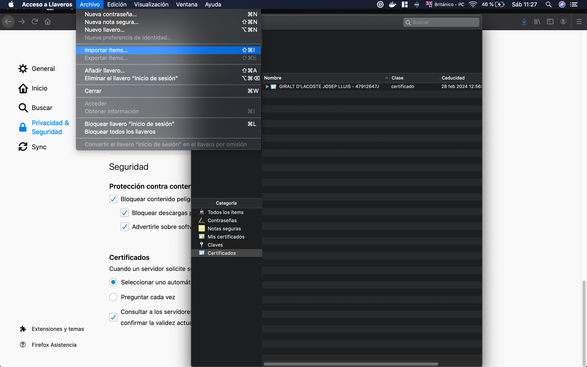
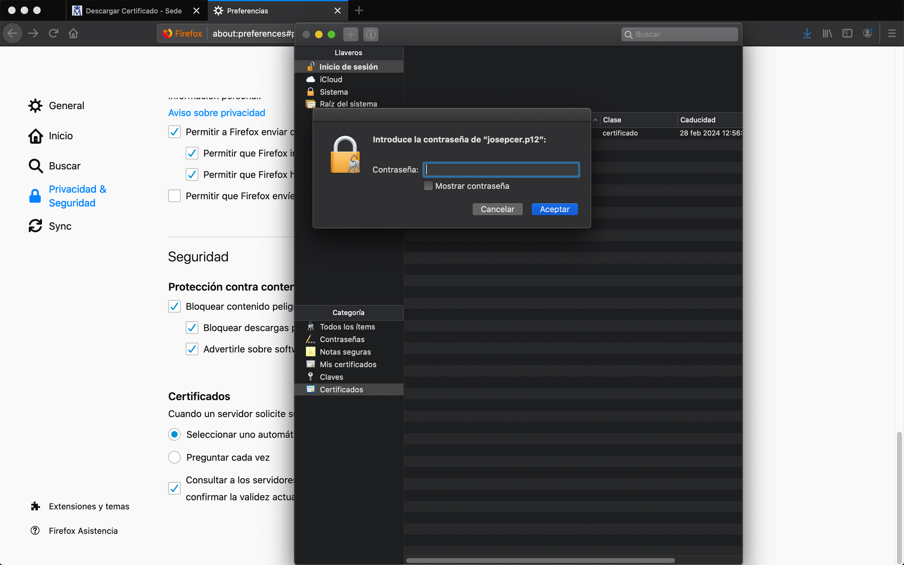

Este año estoy más obsesionado que nunca con identificar las cosas que me roban
tiempo y me desesperan. Aparte, creo que no hay mejor sensación en este mundo
que la de solventar una cosa y darte cuenta, sin rencor hacia ti mismo por el
tiempo perdido, que saber que a partir de ahora algo que te consumía será un
juego de niños. Espero que los que aún no tengáis el certificado que os
identifica como persona física os animéis a tenerlo.

El proceso se supone que es bastante sencillo pero a mí me ha costado una
semana, quizás es porque a veces soy un poco brutico 😅... En este post explico
lo que a mí me ha funcionado. Mi equipo es un MacBook Pro (13-inch, 2017, Two
Thunderbolt 3 ports). Solicitud del certificado

Lo primero que hice es realizar la solicitud del certificado desde la página de
la fábrica de la moneda y timbre, FMNT . Una vez entro en ese enlace se me
advierte que mí navegador no esta soportado para la solicitud, concretamente en
esta página. Esto me lo dicen porque es importante, ya que el navegador desde
el que se hace la solicitud ha de ser el mismo desde el cual se haga la
descarga.

Alguien me dijo que tenia que ver con la clave privada que se genera con la
solicitud que a su vez se guarda en el navegador y por eso ha de ser el mismo.
Realmente me da igual, lo que se, es que si es el mismo navegador funciona.
Alguien más 🤣 me dijo que también funciona con otros navegadores siempre que
sea el mismo, pero yo me limite a seguir las instrucciones de la página de la
FMNT.

En esta se indica que mi navegador por defecto no esta soportado y que me
descargue una versión especifica de firefox, una vez hecho esto regreso a la
página de la solicitud y solicito el certificado. Relleno los campos del
formulario y una vez enviado recibo un correo que contiene un número de
solicitud. Activación y descarga

Una vez tenemos el número de solicitud hemos de pedir cita en la delegación de
hacienda más cercana y mediante el DNI y el número procederán a activar el
certificado. Cuando hayan hecho esto podremos proceder a la descarga a través
del mismo navegador en el cual hicimos la solicitud. Es importante comprobar
que el certificado está instalado en la pestaña de mis certificados y no en el
de personas. Si no está en el de mis certificados algo hemos hecho mal. Para
comprobar que el certificado funciona recomiendo realizar alguna gestión que lo
requiera, en mi caso solicitar una copia de la declaración presentada el año
pasado. Este enlace te invita a acceder con certificado. Si el resultado es un
403 vamos mal.

Debería solicitar contraseña de administrador de equipo y permitirte acceder a
la página de búsqueda de declaraciones ya presentadas.

## Copia de seguridad

Yo no soy un fan de Firefox y quería evitarme volver a pasar por este proceso,
quería una solución definitiva. Pensé que la mejor opción era exportar el
certificado y luego importarlo en Chrome u otro navegador, y usarlo para así
comprobar que lo había exportado correctamente.

1. Para hacer esto nos dirigimos a la pestaña de seguridad y privacidad de
   firefox y "clickamos" en ver nuestros certificados.

   

2. Seleccionamos el certificado dentro del desplegable y le damos a hacer
   copia.

   

3. Seleccionamos el formato Archivos PKCS12, el nombre del fichero destino
   ha de contener la extension que es ".p12". (quizás esto es solo un
   requerimiento de mi equipo, porque la tengo configurada para que siempre
   muestre la extensión).

   

4. Introducimos una contraseña que será necesaria para el proceso de
   importación (recomendado uso de generada por vuestro gestor).

   

5. Importamos el certificado en llaveros de mac e introducimos la
   contraseña.

   

6. Comprobamos su funcionamiento en cualquier otro navegador repitiendo el
   proceso mencionado antes con Firefox.

   

> Bueno espero que esto ayude a alguien, yo perdí unas 15 horas con todo
> esto... imaginarme que consigo ahorrárselas a alguien me hace feliz.
