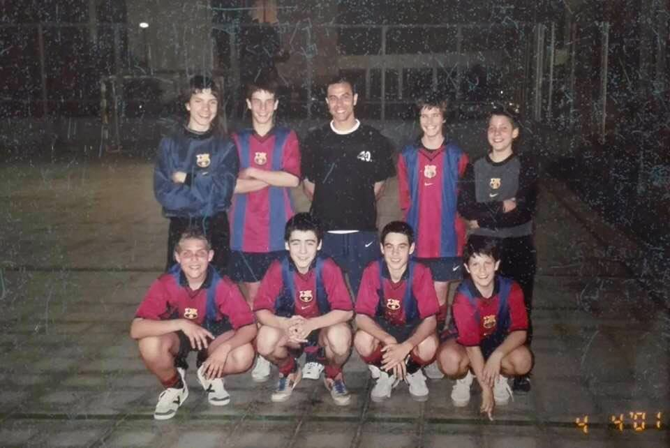

Fa temps que et vull escriure, escriure per dir-te que t'estimo, escriure per
dir-te que ets una persona molt important i un referent a què ha marcat
profundament la meva vida i els valors que em defineixen.

I també disculpar-me pels moments que he renegat de tu per la meva immaduresa o
per la meva incapacitat de veure les coses bones per culpa de la meva tristesa.
La veritat és que ets a tot arreu, sempre que estic fent coses de les quals em
sento orgullós. Jo sempre havia valorat més a la mare perquè ella és metge, ara
us valoro als dos, cadascú amb les seves virtuts. Ella és fantàstica, però tu
també ho ets. Molts cops he sentit a gent que intentava desacreditar-te pel fet
que tu no vas poder acabar la carrera, fins i tot jo he caminat per aquell
camí, disculpem. Tu m'has ensenyat a somiar, a no rendir-me, a ser un senyor, a
tindre paciència, a sempre intentar ser correcte (no sempre ho he aconseguit),
a què la família és el més important, a aguantar la porta, a cedir el pas i en
definitiva m'has ensenyat els valors que crec que són més transcendents i
importants en la vida.

Aquests valors m'han salvat la vida, m'han ajudat a tirar endavant en els
pitjors moments de foscor. M'han donat balanç i el no renunciar amb elles m'han
donat equilibri mentre tot tremolava.

Com més recordo més històries fantàstiques em venen el cap i no puc evitar
plorar per tots els moments en els quals no he estat a l'altura com a fill,
però et prometo que mai oblidaré res del que m'has ensenyat i que unes de les
raons perquè estic tan entregat a la feina i a l'estudi és perquè somio en
trobar l'èxit que em permeti comprar el temps per poder gaudir més al teu
costat i poder gaudir al màxim tot el temps que ens quedi.

Gràcies pel tenis, és un esport meravellós que em va ensenyar a mantenir el cap
fred i el cor calent. Gràcies pel futbol, em va ensenyar a treballar en equip,
a ser solidari i a entendre que amb ajuda arribes més lluny.

Gràcies per portar-me al Sagrats Cors cada matí durant tants anys amb el
Citroën AX i explicar-me tantes històries que han marcat la meva vida durant el
trajecte.

Jo mai em rendeixo, i això es graciés a la història del país dels "honderos",
aquella del noi que apuntava al cel amb la honda i mentre tots es reien d'ell
seguia apuntant al cel, tranquil i seré, mai va arribar al cel però sí que va
ser el que llançava el roc més lluny.

Jo ja no fumo, i és perquè recordo com cada matí just abans de tancar la porta
del Citroën, en deies, "xato, recorda, l'home és el que diu no al tabac". De
fet el meu primer porro el vaig provar als 16 anys. No ha sigut fàcil
deixar-ho, però suposo que com tu em vas dir ara ja em puc considerar un home
:smile:.

Gràcies pels concursos de pesca al pantà de Coma-ruga, on vaig aprendre que el
món està ple de tramposos, en aquest cas, pares que pescaven en lloc del seus
fills. Però que encara que facin trampes si treballes i utilitzes el teu enginy
pots guanyar sense renunciar als teus valors. Recordo que vaig guanyar el
concurs tres anys seguits i recordo que el tercer va ser l'últim perquè a mi
com a primer em van donar una copeta, i al fill de l'organitzador li van donar
una copa el doble de gran. Això em va ensenyar que la victòria sempre ha de
vindre de dins, tu has de ser conscient que has guanyat i ignorar els que els
altres pensin o diguin.

Gràcies pel "ole" cada cop que veies a una noia maca de camí a l'escola, crec
que és el que m'ha permès estimar, valorar i gaudir de tantes dones.

Recordo que vam quedar segons de Barcelona amb l'equip de futbol-sala del
Sagrats Cors. Llavors tothom parlava de l'equip i molta gent en volia formar
part. Lamentablement es va incorporar gent que no tenia gaires qualitats per
jugar bé i en equip. Jo em vaig queixar des del primer minut, però tu em vas
fer romandre cert temps, mentre paral·lelament parlaves amb l'entrenador
plantejant el problema. En veure que era un camí sense sortida i que "el camí
del senyor a vegades és massa solidari" em vas desapuntar i portar a la
florida on vaig poder gaudir més de les meves capacitats.

Puc dir que vaig jugar sis mesos al Barça de futbol sala gràcies al fet que tu
vas moure cel i muntanya perquè fes les proves. Després preferia estar a
"ciber" i fumar porros, però gràcies.

Gràcies pels estius a la tenda de pesca i el forn de pa.

Gràcies per treure'm les coses de casa quan estava perdut i no volia fer res
amb la meva vida.

Gràcies per quedar-te amb la Xula quan em vaig adonar que el raval no era lloc
per a un Border Collie.

Podria seguir i seguir i seguir, però ja t'ho diré quan això acabi fotent un
vermutillo t'estimo.
