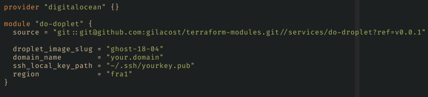
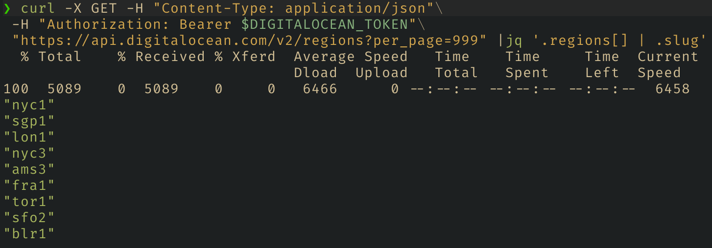

As I mentioned on a previous post, I've been wanting to set up this blog for
ages now. I managed to do it by turning the process interesting and fun. This
blog is hosted in digital ocean and I used terraform to create the droplet
specifying a base image. In fact I could extract a terraform module from this,
so if you want to have the same, you should be able to do so if you require the
module. See the source field in the first screenshot.

> I suggest to read and then if you need to copy the code find it here in this
> [gist](https://gist.github.com/gilacost/4dc06625bae6ec04793d89390876b432).

## Requirements:

- Digital Ocean account. Digital Ocean api key. export
- `DIGITALOCEAN_TOKEN=YOUR_API_KEY`. jq installed. terraform installed.
- generated ssh key pair.

  First create main.tf in a folder of your choice:

    

  Forgive this, I have not set syntax highlight here yet...

## Parameters within the main.tf

droplet image slug: this one is for ghost, you can query the last image slug by
requesting the the api if, see how to do so in the next heading. domain name:
this will be used for naming the droplet and also will create the default dns
record and the A with name www. ssh key path: put the path of the default ssh
key that you use for github or other. This will be needed for easily sshing
into the droplet and do the final configuration for the blog. region: the
region where the droplet will be deployed, I chosen France because it's closer
to Barcelona 🥳.

## Query the available images

In order to run the same command you need to have jq installed.

If you want to list all the images avoid the last pipe to grep. This is the way
that I did it, but if you want you can go to the digital ocean market place and
find the image slug there.

## Request the available regions

You can request the available regions in the same way but in this case the
response is an object that contains a key named regions which contains an array
with the region as objects. Luckily jq allows us to filter by nested parameters
if we use the pipe operator in the query like: '.regions[] | .name':

but we need the slug, so `.regions[] | .slug`:

## Steps once droplet is created

Once you run the terraform script if you have the previous mentioned key added
to the ssh-agent you should be able to ssh to the ip shown in the output of the
terraform apply like: `ssh root@OUTPUT_IP`. Once inside the droplet follow the
instructions 😋.

If you just want to test, don't forget to run terraform destroy after finishing
😗.
