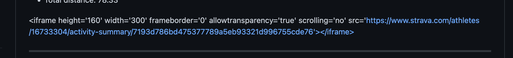
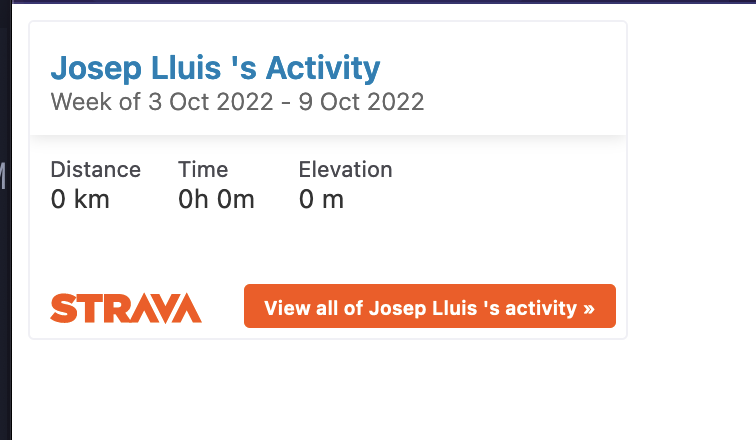
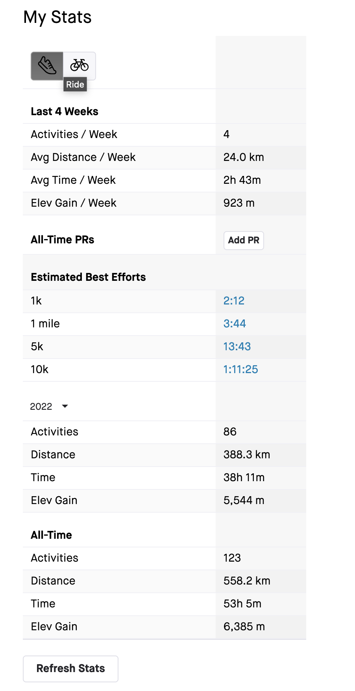

## 🥳 What?

Last Friday (14-10-2022) I was trying to renew my github profile and I thought
that it would be nice to share something outside "coding stuff", so that whoever
visits it might get to know a little bit more about me.

Three months ago I decided to fight some anxiety episodes by running away from
them (literally), so I thought that would be cool to share my strava stats.

## 🤌 Objective

**Share a summary of the strava stats in my github profile**

## 🤯 Iterations

1. Iframe not rendered in github
2. Iframe not working properly anyway
3. Floki, req and the DOM first load

### Iframe not rendered in github

If you go to your profile in strava you will find a share button in the bottom
right corner that says "Share Activities". If you press this button, a pop-up
will appear with some html code (an iframe) that you can embed into your code.
Theoretically markdown lets you use inline html, [see this
post](https://daringfireball.net/projects/markdown/syntax#html).

_The result:_

<!-- TODO compress png -->



As I suspected, even though markdown allows inline html, github does not render
it. It makes sense for security reasons. At this point I thought maybe it does
not work in my github profile but there is not reason why it should not work in
github pages.

### Iframe not working properly anyway

Before trying anything in github pages, I wanted to create a simple html with
the iframe snippet embedded.

```html
<html>
  <body>
    <iframe
      height="160"
      width="300"
      frameborder="0"
      allowtransparency="true"
      scrolling="no"
      src="https://www.strava.com/athletes/16733304/activity-summary/7193d786bd475377789a5eb93321d996755cde76"
    >
    </iframe>
  </body>
</html>
```

Surprisingly the iframe is not rendering the right stats. In fact, it looks like
it is not rendering any stats at all.



Yet these are the real stats in the my public profile:



At this point I opened a ticket in strava support and totally parked the iframe
idea.

### Floki, req and the DOM first load

As the public profile is loading the right stats, my mind tells me that the
next natural approach is to parse the DOM in that public page and gather the
stats.

Thanks to elixir scripting introduced in [elixir 1.12](https://github.com/elixir-lang/elixir/releases/tag/v1.12.0) we can easily achieve this by using req and floki with
[`Mix.install/2`](https://hexdocs.pm/mix/1.12/Mix.html#install/2):

```elixir
Mix.install([
  {:req, "~> 0.2"},
  {:floki, "~> 0.33.1"}
])

"https://www.strava.com/athletes/1673330"
|> Req.get!()
|> Map.fetch!(:body)
|> Floki.parse_document()
```

Unfortunately this does not work as the stats shown in the public profile are
loaded after the DOM has been rendered by some 💩 jQuery or who knows 🤷. This
outcome drove me to my latest iteration and final solution.

## 🤠 Final solution

1. Strava API
   1. Refreshing the OAuth token
   2. Getting the activities
   3. EEX and rewriting the readme
2. Automating the summary with GHA

### Strava API

**You need to create an strava application, see
[the docs](https://developers.strava.com/docs/authentication/).**

To be able to perform requests the Strava API without user interaction, we need
to get a OAuth refresh token. We can build a simple router with plug and
[strava](https://github.com/slashdotdash/strava) to print the refresh token
like this:

```elixir
defmodule StravaSync.Router do
  use Plug.Router

  plug Plug.Logger
  plug :match
  plug :dispatch

  get "/activities" do
    url =
      "http://www.strava.com/oauth/authorize?client_id=#{Strava.client_id()}&response_type=code" <>
        "&redirect_uri=#{URI.encode_www_form(Strava.redirect_uri())}&approval_prompt=force" <>
        "&scope=read_all,profile:read_all,activity:read_all,activity:write"

    body = "<html><body>You are being <a href=\"#{url}\">redirected</a>.</body></html>"

    conn
    |> put_resp_header("location", url)
    |> send_resp(conn.status || 302, "text/html", body)
  end

  get "/authenticate" do
    conn =
      %{
        query_params: %{
          "code" => code
        }
      } = conn |> fetch_query_params()

    %OAuth2.Client{
      token: %OAuth2.AccessToken{
        refresh_token: refresh_token
      }
    } = Strava.Auth.get_token!(code: code, grant_type: "authorization_code")

    IO.inspect(refresh_token, label: RefreshToken)
    send_resp(conn, 200, "application/json", Jason.encode!(%{refresh_token: refresh_token}))
  end

  match _ do
    send_resp(conn, 404, "text/html", "oops")
  end

  defp send_resp(conn, status, content_type, body) do
    conn
    |> put_resp_content_type(content_type)
    |> send_resp(conn.status || status, body)
  end
end
```

Once you visit `localhost:4000/activities` and you follow the OAuth
authorization flow, you need to save the `refresh_token` somewhere.

#### Refreshing oauth token

After getting the refresh token you can ask for new access tokens if you hit
the refresh token url with your `client_id` and `client_secret` as query
params.

```elixir
Mix.install([
  {:req, "~> 0.2"},
  {:timex, "~> 3.7.9"}
])

strava_client_id = System.get_env("STRAVA_CLIENT_ID")
strava_refresh_token = System.get_env("STRAVA_REFRESH_TOKEN")
strava_client_secret = System.get_env("STRAVA_CLIENT_SECRET")

refresh_token_url =
  "https://www.strava.com/oauth/token?" <>
    "grant_type=refresh_token&refresh_token=#{strava_refresh_token}&" <>
    "client_id=#{strava_client_id}&client_secret=#{strava_client_secret}"

%{
  body: %{
    "access_token" => access_token,
    "refresh_token" => refresh_token
  }
} = Req.post!(refresh_token_url)
...
```

#### Getting the activities

By hitting the refresh token url beforehand, we ensure that anytime we hit the
activities url, our `access_token` will be valid; making our stats gathering
script idempotent. Now we can get the activities like so:

```elixir
...
after_unix = Date.utc_today() |> Timex.shift(months: -1) |> Timex.to_unix()

{:ok, %{body: activities}} =
  Req.get("https://www.strava.com/api/v3/athlete/activities?after=#{after_unix}&per_page=200",
    headers: [{"Authorization", "Bearer #{access_token}"}]
  )
...
```

**I wanted the stats of the last month, that is why after_unix is in place.**

#### EEX and rewriting the readme

All of this is looking quite sexy so far, but, how do I show this in the
readme? If I want the stats to be shown in my profile, I need to use some kind
of templating system that allows me to build the stats and produce a new
updated readme.

This is when EEX comes to play:

```elixir
...
new_readme =
  "README.md.eex"
  |> File.read!()
  |> EEx.eval_string(
    number_of_runs: number_of_runs,
    total_elevation_gain: :erlang.float_to_binary(summary.total_elevation_gain, decimals: 2),
    total_time: Format.to_hh_mm_ss(summary.total_time),
    total_distance:
      summary.total_distance |> Kernel./(1000) |> :erlang.float_to_binary(decimals: 2),
    from_date: after_unix |> DateTime.from_unix!() |> DateTime.to_date(),
    to_date: DateTime.utc_now() |> DateTime.to_date()
  )

File.write!("README.md", new_readme)
```

and the `README.md.eex` contains:

```eex
  * Runs: <%= number_of_runs %>
  * Elevation Gain: <%= total_elevation_gain %> m
  * Total time: <%= total_time %>
  * Total distance: <%= total_distance %> km
```

### 🤖 Automating the summary with GHA.

If you know me, you will already be aware that if something can be automated, I
will do so.

In this case I wanted to:

- RUN the sexy script on a weekly basis.
- Commit the new readme.

I did this via [github_actions](https://github.com/features/actions):

```yaml
---
- name: Strava sync
  env:
    STRAVA_CLIENT_ID: ${{ secrets.STRAVA_CLIENT_ID }}
    STRAVA_REFRESH_TOKEN: ${{ secrets.STRAVA_REFRESH_TOKEN }}
    STRAVA_CLIENT_SECRET: ${{ secrets.STRAVA_CLIENT_SECRET }}
  run: elixir strava_sync.ex

- name: Get current date
  id: date
  run: echo "::set-output name=date::$(date +'%Y-%m-%d')"

- name: Commit changes
  uses: EndBug/add-and-commit@v9
  with:
    author_name: Josep Lluis Giralt D'Lacoste
    author_email: josepgiraltdlacoste@gmail.com
    message: "Strava sync ${{ steps.date.outputs.date }}"
    add: "*.md"
```

- find the full elixir script in [here](https://github.com/gilacost/gilacost/blob/master/strava_sync.ex).
- find the GHA action in [here](https://github.com/gilacost/gilacost/blob/master/.github/workflows/strava_sync_ex.yml).
- latest strava sync workflow badge 

<hr>

<p align="center">
<b>love ❤️ and peace 🐦 to all</b>
</p>
