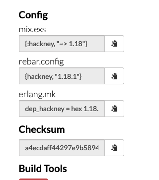

## 🥳 What?

After writing my [strava summary](./STRAVA_SUMMARY.md), a small script that
gathers Strava stats and commits weekly to my Github profile using GitHub
actions and elixir, I decided to publish my venture into
[elixir status](https://elixirstatus.com/). I love putting things out there and
imagining that maybe someone enjoys reading them 😋. What I was not expecting,
was to receive an invitation to the Elixir Mix podcast 😱. Talking on a podcast
scares me. I like to be well prepared whenever I do any public speaking, so I
used this project as a way to have something to talk about and to highlight my
love for the BEAM ecosystem and it's beautiful community.

<!-- date of the elixir mix episode -->

## 🤌 Objective

**Replicate my strava summary in erlang**.

## 🤯 What do we need?

The implementation should be much more straight forward this time because,
theoretically, we just need to translate the content from elixir to erlang.
The steps we need to consider are:

1. We need to take into account that erlang does not have a templating engine
   built-in.
2. We need the capacity of making http requests.
3. We need to be able to iterate easily.
4. We should be able to include dependencies that will be used by the `escript`.
5. Ideally we would like to maintain only one readme template even if we use
   different engines.

## 🚀 Iterations

1. Using plain escript
2. Moving to rebar3
   1. Escriptize with `inets`
      1. Rebar new escript
      2. Including `inets`
   2. Hackney to the rescue

## Using plain escript

My first iteration of translating my script was not successful. But, I wanted
to include in this explanation as I thought it might be useful to highlight how
I first approached the project.

After some research - when I say "research" I mean googling "scripting in
erlang"

- the first thing that I did was land on the official erlang docs for
  [`escript`](https://www.erlang.org/doc/man/escript.html). I then copied and
  pasted their factorial `escript` example:

```erlang
#!/usr/bin/env escript
%% -*- erlang -*-
%%! -sname factorial -mnesia debug verbose
main([String]) ->
    try
        N = list_to_integer(String),
        F = fac(N),
        io:format("factorial ~w = ~w\n", [N,F])
    catch
        _:_ ->
            usage()
    end;
main(_) ->
    usage().

usage() ->
    io:format("usage: factorial integer\n"),
    halt(1).

fac(0) -> 1;
fac(N) -> N * fac(N-1).
```

The docs explained that to run it you need to:

```bash
$ chmod u+x factorial
$ ./factorial 5
factorial 5 = 120
$ ./factorial
usage: factorial integer
$ ./factorial five
usage: factorial integer
```

_Note: pay attention to the first line in the file! It enables you to run the
script via `./factorial` if you do not specify the bin env to use escript, then
you need to run the script via `escript factorial`_

This iteration was encouraging because I executed my first script in erlang,
but I immediately discarded it because I could not find in the docs an
explanation of how to include external dependencies in our script.
Theoretically we won't need any dependencies to make requests thanks to inets,
however, we will definitely need a dependency to decode json and another for the
templating engine 💆🏽‍♂️..

## Moving to rebar3

Ok, that was useful. No joke, it was. Sometimes you just need to get started,
and that will help you end up where you wanted 🫶. My most immediate thought
after this dead end was to look at `rebar3`. If you come from elixir I am sure
that you have seen rebar from time to time, but if you do not know what it is,
rebar is for erlang what `mix` is for elixir. It's a tool that allows you to
create umbrellas, run tests with eunit, dialyzer and other interesting/useful
tasks. In our case, we are interested in
[escriptize](https://rebar3.org/docs/getting-started/)

_Note: at the time of writing if you google "rebar docs" you might end up at
`https://rebar3.readme.io/docs/getting-started` and a beautiful 404 will arise_


So please, if you are interested in knowing more about rebar, find the official
docs [here](https://rebar3.org/docs/getting-started/).

### Escriptize with `inets`

#### Rebar new escript

First things first, lets create the escript with rebar3:

```bash
❯ rebar3 new escript strava_sync
===> Writing strava_sync/src/strava_sync.erl
===> Writing strava_sync/src/strava_sync.app.src
===> Writing strava_sync/rebar.config
===> Writing strava_sync/.gitignore
===> Writing strava_sync/LICENSE
===> Writing strava_sync/README.md
```

This creates a folder strava_sync:

```bash
.
├── LICENSE
├── README.md
├── rebar.config
├── rebar.lock
└── src
    ├── strava_sync.app.src
    └── strava_sync.erl
```

This looks more convoluted than our simple [strava_sync.ex](../strava_sync.ex),
but 🐻 with me. Forget about the README and LICENSE files. We only need to look
at `rebar.config` and `strava_sync.erl` at the minute.

- The `rebar.config` is similar to the `mix.exs` file. It allows us to add  
  dependencies and include extra applications.
- The `strava_sync.erl` will be the entrypoint of our escript.

Lets try to compile the script and run it!

```bash
❯ rebar3 escriptize
===> Verifying dependencies...
===> Analyzing applications...
===> Compiling strava_sync
===> Building escript for strava_sync...
```

This is not a super useful output because we have no clue of where has it been
built 😅. But if we run `ls` we'll see that now, we have a `_build` directory.
When we check its contents, we see:

```bash
.
└── default
    ├── bin
    │   └── strava_sync
    └── lib
        └── strava_sync
            ├── ebin
            │   ├── strava_sync.app
            │   └── strava_sync.beam
            ├── include -> ../../../../include
            ├── priv -> ../../../../priv
            └── src -> ../../../../src
```

This is similar to elixir and its _build_ directory right? We are all connected
🤖. Why is it named default? If we look at our `rebar.config` we'll see that
there is a profile named test. When you perform rebar commands you can specify
a profile to be used when running them, if you do not specify one, it will
default to default 🤓. Try to run it with test profile!

```bash
❯ rebar3 as test escriptize
===> Verifying dependencies...
===> Analyzing applications...
===> Compiling strava_sync
===> Building escript for strava_sync...
```

Now if we do a tree _build_, we'll see that we have the test profile folder:

```bash
_build
├── default
│   ├── bin
│   │   └── strava_sync
│   └── lib
│       └── strava_sync
│           ├── ebin
│           │   ├── strava_sync.app
│           │   └── strava_sync.beam
│           ├── include -> ../../../../include
│           ├── priv -> ../../../../priv
│           └── src -> ../../../../src
└── test
    ├── bin
    │   └── strava_sync
    └── lib
        └── strava_sync
            ├── ebin
            │   ├── strava_sync.app
            │   └── strava_sync.beam
            ├── include -> ../../../../include
            ├── priv -> ../../../../priv
            └── src -> ../../../../src
```

#### Including inets

_Note: if you want to iterate quickly I suggest using rebar3 shell (similar to
iex) and trigger recompile with `r3:do(compile)`_

I do not know how the rest of the world operates, but I personally, enjoy using
as least dependencies as possible 🤠, it just gives me joy 👻. In this case, I
was expecting to avoid including a dependency to make http requests thanks to
`inets`. Inets is an erlang application that is part of the [OTP codebase]
(https://github.com/erlang/otp/blob/33deeffc95f3e82fc39c004392131892d16faa43/lib/inets/src/inets_app/inets.app.src)
and that if you read its [docs](https://www.erlang.org/doc/man/inets.html), it
provides the most basic api to the clients and servers that are part of the
inets application. In our case we are interested in `:httpc` (client) not
`httpd` (daemon).

_Note: if you need an http client, you can also start inets in a mix project by
adding inets to your `extra_applications: [:logger, :runtime_tools, :inets]`_

Let's include inets as an extra application in the rebar.config

```erlang
{escript_incl_apps, [ strava_sync, inets]}.
```

and then check that inets has actually started 🤪:

```erlang
rebar3 shell

> application:loaded_applications().
[{asn1,"The Erlang ASN1 compiler version 5.0.18","5.0.18"},
 {crypto,"CRYPTO","5.0.6.3"},
 {rebar,"Rebar: Erlang Build Tool","3.20.0"},
 {public_key,"Public key infrastructure","1.12.0.1"},
 {kernel,"ERTS  CXC 138 10","8.3.2.1"},
 {inets,"INETS  CXC 138 49","7.5.3.1"},
 {stdlib,"ERTS  CXC 138 10","3.17.2.1"},
 {compiler,"ERTS  CXC 138 10","8.1.1.1"},
 {ssl,"Erlang/OTP SSL application","10.7.3.4"}]
```

Great! now let's try to make a request!

```erlang
Eshell V12.3.2.5  (abort with ^G)
1> httpc:request("https://postman-echo.com/get?foo1=bar1&foo2=bar2").
=WARNING REPORT==== 21-Nov-2022::21:30:03.630457 ===
Description: "Authenticity is not established by certificate path validation"
     Reason: "Option {verify, verify_peer} and cacertfile/cacerts is missing"

{ok,{"HTTP/1.1",200,"OK"},
     [{"connection","keep-alive"},
      {"date","Mon, 21 Nov 2022 19:30:04 GMT"},
      {"etag","W/\"10c-v695eZkjLtlSDz5oY6QZgzS2EiM\""},
      {"vary","Accept-Encoding"},
      {"content-length","268"},
      {"content-type","application/json; charset=utf-8"},
...
```

This is looking good. Well there is a warning reported by sasl that is a bit
concerning, but we had an http response 🙌.

Now that we have the capability of performing http requests, let's try to get
our OAUTH refreshed token, just like we did in our
[strava_sync.ex](../strava_sync.ex).

```elixir
...
# in ../strava_sync.ex
refresh_token_url =
  "https://www.strava.com/oauth/token?" <>
    "grant_type=refresh_token&refresh_token=#{strava_refresh_token}&" <>
    "client_id=#{strava_client_id}&client_secret=#{strava_client_secret}"
...
```

Let's comment everything in our elixir script and `IO.puts()` the url to copy
and paste it into our `eshell` and then make an http request. This time we'll
use [`request-4`](https://www.erlang.org/doc/man/httpc.html#request-4).

```erlang
3> RefreshTokenUrl="https://www.strava.com/oauth/token?grant_type=refresh_token&\
refresh_token=*****&client_id=****&client_secret=*****".
4> httpc:request(post, {RefreshTokenUrl, []}, [],[]).
{error,invalid_request}
```

This is a dead end. I never found out why this error was happening. As you can
see, the message is not useful. After diving into the inets codebase for about
one hour and hammering 🔨 `httpc` in the `eshell`, I decided to let it go 🙇
and include one dependency to solve this! I guess it is not going to be the end
of the world if I include an http client even that there is one built-in 🥹.

### Hackney to the rescue

Let's clean up inets from the `rebar.config`. Once this is done, let's add
hackney as a dependency:

1. Visit [hex.pm](https://hex.pm).
2. Search for hackney
3. And finally copy the instructions for `rebar.config` (see picture below).



Adding it to our `rebar.config`:

```erlang
{deps, [
    {hackney, "1.18.1"},
]}.
```

Now if we start a rebar3 shell session, we should see how hackney is fetched:

```erlang
❯ rebar3 shell
===> Verifying dependencies...
===> Fetching hackney v1.18.1
===> Fetching certifi v2.9.0
===> Fetching idna v6.1.1
===> Fetching metrics v1.0.1
===> Fetching mimerl v1.2.0
===> Fetching parse_trans v3.3.1
===> Fetching ssl_verify_fun v1.1.6
===> Fetching unicode_util_compat v0.7.0
===> Analyzing applications...
===> Compiling unicode_util_compat
===> Compiling idna
===> Compiling metrics
===> Compiling ssl_verify_fun
===> Compiling parse_trans
===> Compiling mimerl
===> Compiling certifi
===> Compiling hackney
===> Analyzing applications...
===> Compiling strava_sync
Erlang/OTP 24 [erts-12.3.2.5] [source] [64-bit] [smp:4:4] [ds:4:4:10]
[async-threads:1] [jit]

Eshell V12.3.2.5  (abort with ^G)
```

If we read the [hackney docs](https://github.com/benoitc/hackney#basic-usage),
we'll see that we need to be sure that hackney application is started. We can
do this by running `application:ensure_all_started(hackney).`. Now let's try
perform the same request that failed with `httpc`.

```erlang
4> hackney:request(post, RefreshTokenUrl, [], <<>>, []).
{ok,200,
    [{<<"Content-Type">>,<<"application/json; charset=utf-8">>},
     {<<"Transfer-Encoding">>,<<"chunked">>},
     {<<"Connection">>,<<"keep-alive">>},
     {<<"Date">>,<<"Mon, 21 Nov 2022 20:09:43 GMT">>},
     {<<"Via">>,
      <<"1.1 linkerd, 1.1 linkerd, 1.1 f4a2a568790100f41e907486ba960ec
6.cloudfront.ne"...>>},
     {<<"ETag">>,<<"W/\"e49745cbf143d2e8f564b22a33f254e2\"">>},
     {<<"Vary">>,<<"Origin">>},
     {<<"Server">>,<<"nginx/1.21.3">>},
     {<<"Status">>,<<"200 OK">>},
     {<<"X-Request-Id">>,
      <<"471aab0a-33c4-40aa-a0fa-72fcebcdd6ad">>},
     {<<"Cache-Control">>,
      <<"max-age=0, private, must-revalidate">>},
     {<<"Referrer-Policy">>,
      <<"strict-origin-when-cross-origin">>},
     {<<"X-Frame-Options">>,<<"DENY">>},
     {<<"X-XSS-Protection">>,<<"1; mode=block">>},
     {<<"X-Download-Options">>,<<"noopen">>},
     {<<"X-Content-Type-Options">>,<<"nosniff">>},
     {<<"X-Permitted-Cross-Domain-Policie"...>>,<<"none">>},
     {<<"X-Cache">>,<<"Miss from cloudfront">>},
     {<<"X-Amz-Cf-Pop">>,<<"ATH50-C1">>},
     {<<"X-Amz-Cf-Id">>,<<"S_s3r4hzQj1SUBOV"...>>}],
    #Ref<0.2549691784.111673345.65059>}
```

We have an OK response 🤘.

Now it is just a matter of translating the code base from
[`strava_sync.ex`](../strava_sync.ex) into the entry point
`src/strava_sync.erl` and we are off the races. 🏎

## Final notes

1. Extra dependencies added to `rebar.config`:

```elixir
{deps, [
    {bbmustache, "1.12.2"},
    {hackney, "1.18.1"},
    {jsx, "3.1.0"},
    {edate, {git, "https://github.com/dweldon/edate.git", {branch, "master"}}}
]}.
```

_Note: pay attention to edate. The published version in hex does not work, so I
had to pull the dependency directly from github_.

2. The `sed` trick for README.mustache to avoid having to maintain two templates.

```yaml
---
- name: Turn EEX template into a mustache one
  run: |
    sed -e 's/ <%= / {{ /g' README.md.eex | sed -e 's/ %> / }} /g' | sed -e 's/ %>/ }}/g' > README.mustache
```

_I know it is ugly but eh, make it work!_

3. Now there is a workflow in elixir that runs on Sundays and another in erlang
   that runs on Mondays.

4. In order to iterate quickly and avoid hitting the strava api rate limit,
   I decided to store the [activities.json](../strava_sync/activities.json) and
   use eunit to speed up the implementation of the activities reduction into
   the summary:

```erlang
-ifdef(TEST).
-include_lib("eunit/include/eunit.hrl").
summary_test_() ->
    {ok, Activities} = file:read_file("activities.json"),
    ActivitiesDecoded = jsx:decode(Activities, [{return_maps, true}]),
    RunsSummary = runs_summary(ActivitiesDecoded, empty_summary()),

    [
        ?_assertEqual(
            #{
                "avg_pace" => 32.654,
                "from_date" => edate:date_to_string(edate:shift(edate:today(), -1, month)),
                "number_of_runs" => 13,
                "to_date" => edate:date_to_string(edate:today()),
                "total_distance" => <<"84.29">>,
                "total_elevation_gain" => 3328.5
            },
            maps:remove("total_time", RunsSummary)
        )
    ].
-endif.
```

_The test above can be run via `rebar3 eunit`_

<hr>

- find the rebar.config [here](https://github.com/gilacost/gilacost/blob/master/strava_sync/rebar.config).
- find the full erlang ecript in [here](https://github.com/gilacost/gilacost/blob/master/strava_sync/src/strava_sync.erl).
- find the GHA action in [here](https://github.com/gilacost/gilacost/blob/master/.github/workflows/strava_sync_erl.yml).
- latest strava sync erl workflow badge 

<hr>

<p align="center">
<b>love ❤️ and peace 🐦 to all</b>
</p>
